# Cassettes Classification
This project uses the MAX78000 FTHR to classify 8 types of wafer cassettes by applying a cat vs dog project.  
More information about MAX78000/MAX78002, Software, Example [here](https://github.com/MaximIntegratedAI).
## Table of Contents
1. Setup for window system
2. Collect the dataset
3. Prepare dataset
4. Development project 
## Setup for window system
1. Analog Devices MSDK (MaximMSDK) [Download Analog Devices MSDK](https://analogdevicesinc.github.io/msdk//USERGUIDE/#gui-installation)

2. Visual Studio Code [Download Visual Studio Code](https://code.visualstudio.com/Download) | [Setup (VS Code)](https://analogdevicesinc.github.io/msdk//USERGUIDE/#installation:~:text=this%20User%20Guide.-,Setup%20(VS%20Code),-The%20setup%20below)

3. Powershell Use for setup virtual environment and Development project

4. Pytorch [Dowload Pytorch](https://pytorch.org/#:~:text=and%20easy%20scaling.-,INSTALL%20PYTORCH,-Select%20your%20preferences)  
Change the Compute Platform package according to what your computer has.
For my example, I'm going to install via Pip and my laptop doesn't have a GPU, so I chose CPU. Then copy command and run on Powershell.
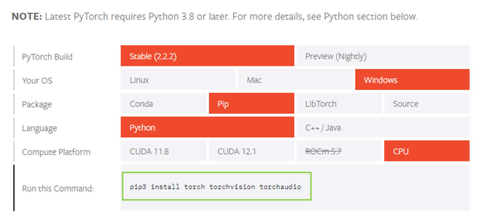
Can study the installation steps in detail at [here.](https://www.youtube.com/watch?v=wCuJncQsXxI)

5. Git [Download Git](https://www.git-scm.com/download/win)  
Use Git for cloned folder from GitHub.

6. PYENV for win [More Information](https://github.com/pyenv-win/pyenv-win)    
Open Powershell Run administrator.  

**Install pyenv-win**
```
Invoke-WebRequest -UseBasicParsing -Uri "https://raw.githubusercontent.com/pyenv-win/pyenv-win/master/pyenv-win/install-pyenv-win.ps1" -OutFile "./install-pyenv-win.ps1"; &"./install-pyenv-win.ps1"
```
Reopen(close power shell and open again)
```
pyenv --version
```
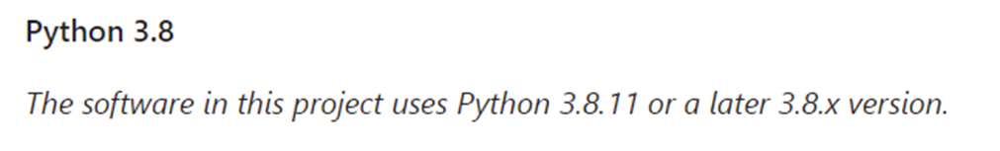
Using pyenv install python 3.8.10  
**Note** I developed this project when Analog Devices AI was still using Python version 3.8.X; I'm not sure if it will work now. I noticed that 
Analog Devices AI GitHub has updated the Python version to 3.11.X now. 
```
pyenv install 3.8.10
```

Set Python 3.8.10 global
```
pyenv global 3.8.10
```

Then check pyenv version
```
pyenv version
```

**Clone project and set virtual environment**  
Create folder for example I created projectAI, For storing cloned files from GitHub.

**Training**  
Clone ai8x-training
```
git clone --recursive https://github.com/analogdevicesinc/ai8x-training.git
```

Go to folder ai8x-training
```
cd ai8x-training
```

Set Python 3.8.10 local
```
pyenv local 3.8.10
```

Then check pyenv version
```
pyenv version
```

Create environment ai8x-training 
```
python -m venv venv --prompt ai8x-training
```

Activate environment
```
.\venv\Scripts\activate
```

Install wheel setuptools (If have an error try to run command again)
```
(ai8x-training) > pip3 install -U pip wheel setuptools
```

For minor updates, pull the latest code and install the updated wheels:
```
(ai8x-training) > git pull
(ai8x-training) > git submodule update --init
(ai8x-training) > pip3 install -U pip setuptools
(ai8x-training) > pip3 install -U -r requirements.txt
```

Deactive environment ai8x-training
```
deactivate
```

Go back to projectAI
```
cd ..
```

**Synthesis**  
Clone ai8x-synthesis
```
git clone --recursive https://github.com/analogdevicesinc/ai8x-synthesis.git
```
Go to folder ai8x-synthesis
```
cd ai8x-synthesis
```

Set Python 3.8.10 local
```
pyenv local 3.8.10
```

Then check pyenv version
```
pyenv version
```

Create environment ai8x-synthesis 
```
python -m venv venv --prompt ai8x-synthesis
```

Activate environment
```
.\venv\Scripts\activate
```

Install wheel setuptools (If have an error try to run command again)
```
(ai8x-synthesis) > pip3 install -U pip setuptools
```

Install requirements
```
pip3 install -r requirements.txt
```

Now the folders in the project should be as follows.  
```
projectAI 
 ├─ ai8x-training
 └─ ai8x-synthesis       
```
## How to upload code to the board
Press the shortcut Ctrl+Shift+B to open the available Build Tasks.
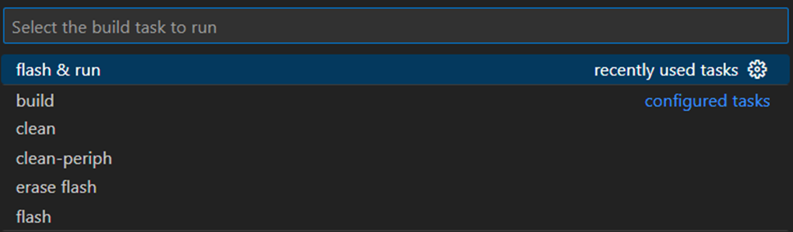
- build: Compiles the program.
- clean: Deletes compiled files.
- clean-periph: specifically focused on cleaning or removing files and configurations associated with peripheral devices.
- flash: Flashes the program onto the target device using OpenOCD.
- flash & run: Flashes the program onto the target device and starts running it immediately.
- erase flash: Erases data in the Flash memory of the target device using OpenOCD.

Don't forget change board
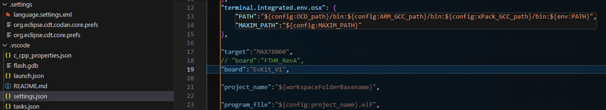

## Collect the dataset
Edit the example code folder named **Imgcapture** with two capture commands: Shoot and Stream.
- The shoot command is used to take one image at a time. You can press the switch to take an image.
- The stream command is used to continuously take images.

Open Imgcapture folder 
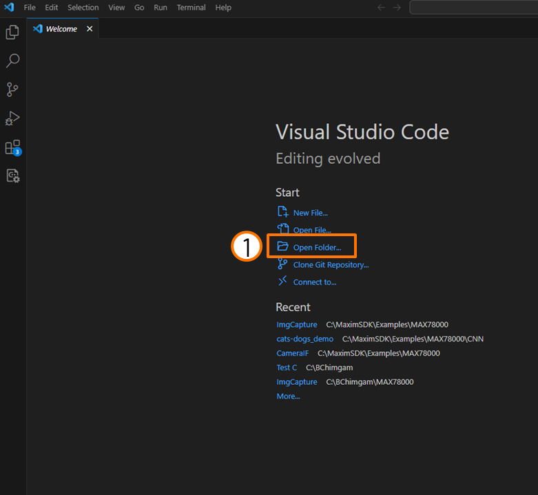
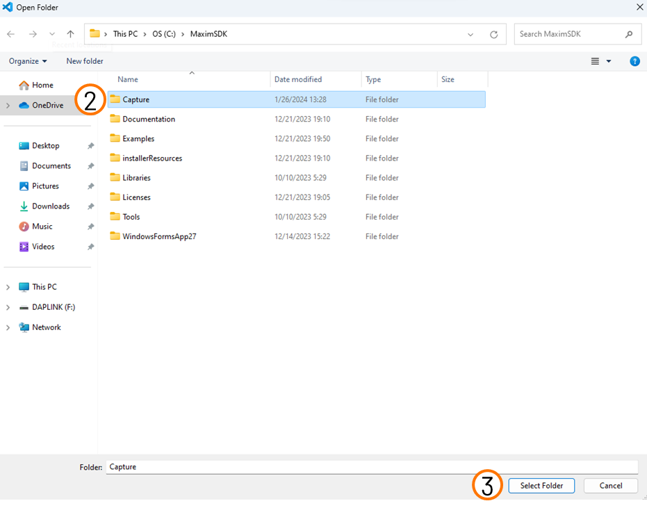
Flash and run code
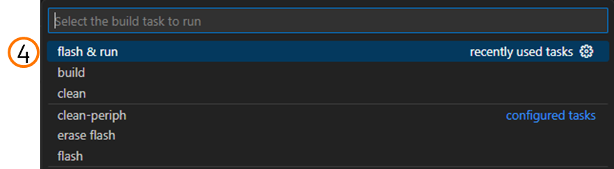
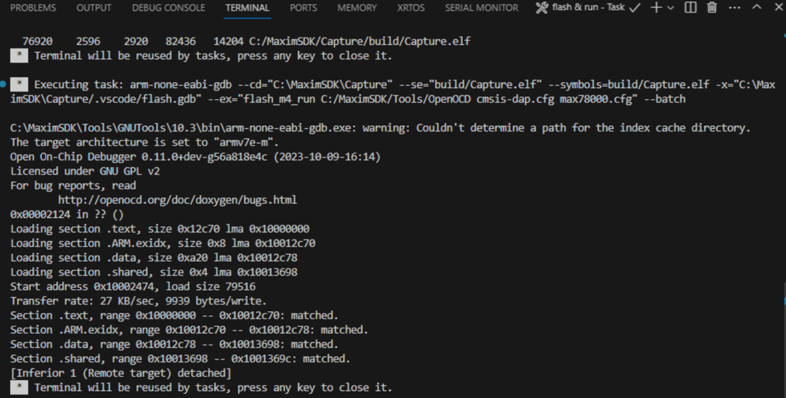
Click open cmd
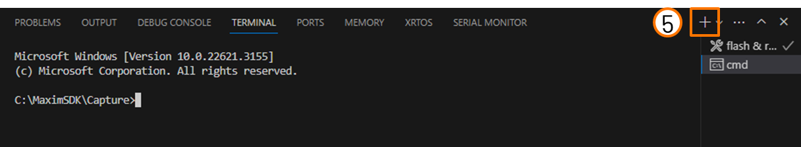
Go to utils folder utils
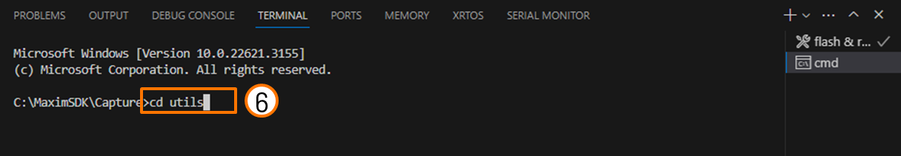
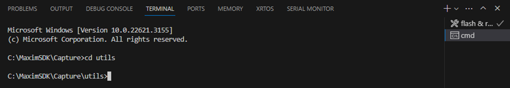
Run : python console.py com X(change X to your comport)
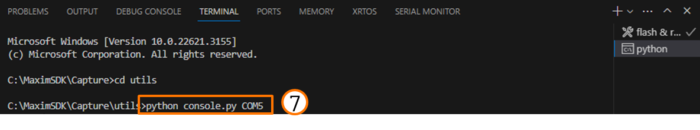
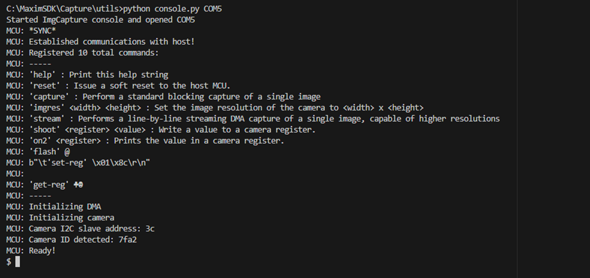
Now the program is ready to receive commands.    
Sent command shoot (take one picture)
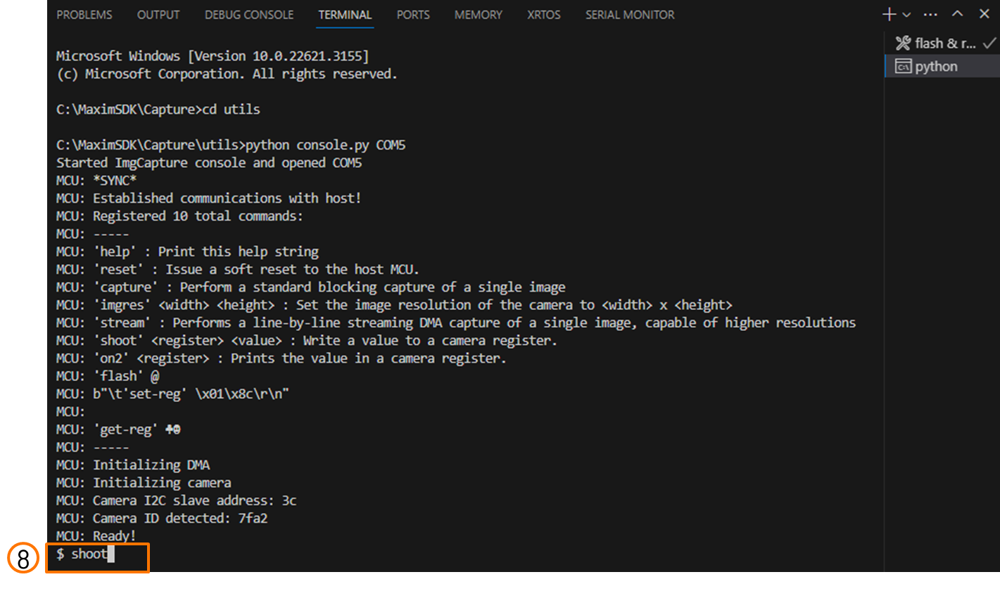
Take a photo by pressing the switch and save successfully.
(Connect P0_19 and GND to switch.)
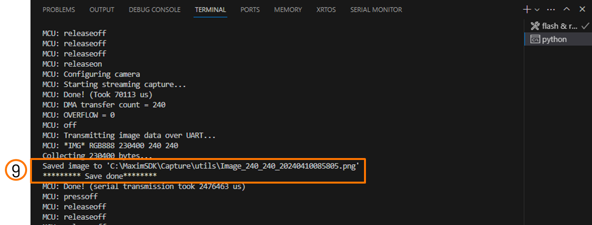
If want to stop sent command shoot again

Sent command stream (Continuous take pictures)
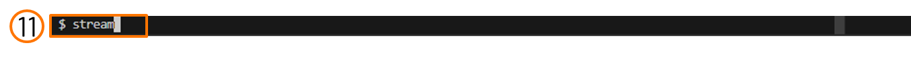
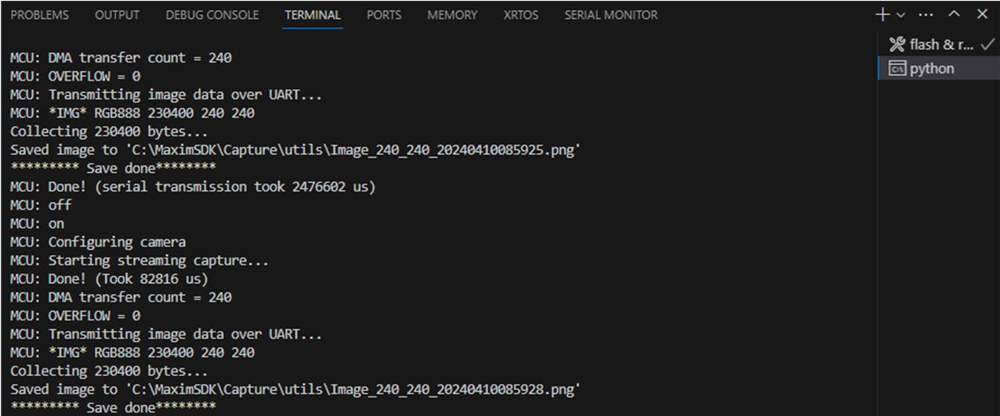
If want to stop sent command stream again 

Images store here
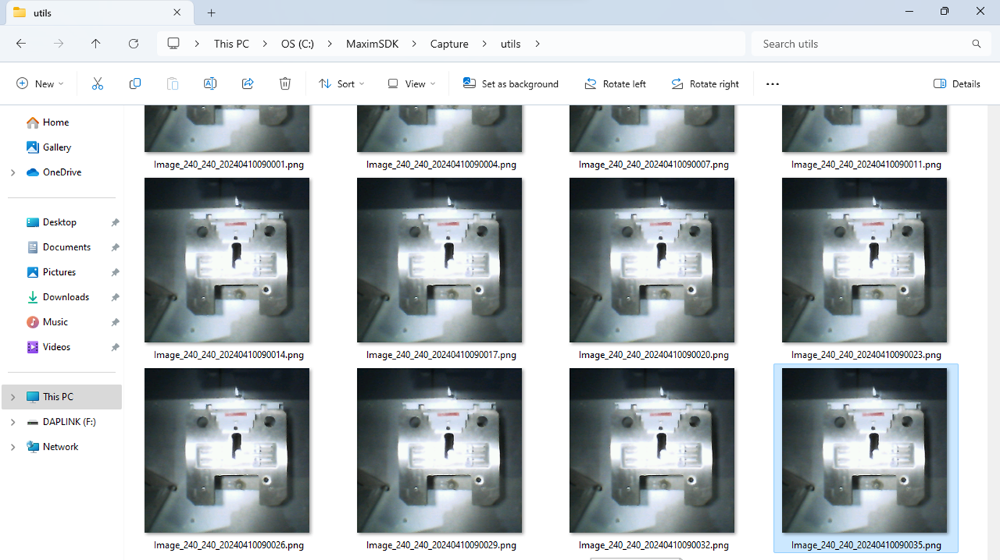
## Prepare dataset

## Development projeect 
**1. Training**

Start training the model
```
python train.py --epochs 100 --optimizer Adam --lr 0.001 --wd 0 --deterministic --compress policies/schedule-catsdogs.yaml --qat-policy policies/qat_policy_cd.yaml --model ai85cdnet --dataset cassette --confusion --param-hist --embedding --device MAX78000 --validation-split 0.15 --batch-size 64  --enable-tensorboard
```
When training complete Check point will store …/ai8x-training-logs
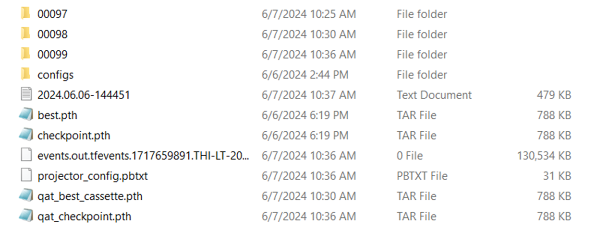

**2. Synthesis**

**3. Deployment**
