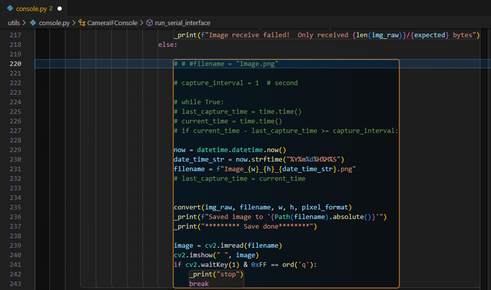
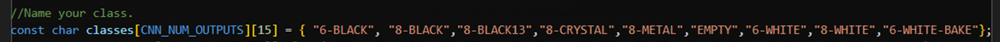

# Cassettes Classification
This project uses the MAX78000 FTHR to classify 8 types of wafer cassettes by applying a cat vs dog project.    
The project design idea is as follows:

More information about MAX78000/MAX78002, Software, Example [here](https://github.com/MaximIntegratedAI).

## Table of Contents
1. [Setup for window system](#setup-for-window-system)
2. [Collect the dataset](#collect-the-dataset)
3. [Prepare dataset](#prepare-dataset)
4. [Development project](#development-project)

## Setup for window system
1. Analog Devices MSDK (MaximMSDK) [Download Analog Devices MSDK](https://analogdevicesinc.github.io/msdk//USERGUIDE/#gui-installation)

2. Visual Studio Code [Download Visual Studio Code](https://code.visualstudio.com/Download) | [Setup (VS Code)](https://analogdevicesinc.github.io/msdk//USERGUIDE/#installation:~:text=this%20User%20Guide.-,Setup%20(VS%20Code),-The%20setup%20below)

3. Powershell Use for setup virtual environment and Development project

4. Pytorch [Dowload Pytorch](https://pytorch.org/#:~:text=and%20easy%20scaling.-,INSTALL%20PYTORCH,-Select%20your%20preferences)  
Change the Compute Platform package according to what your computer has.
For my example, I'm going to install via Pip and my laptop doesn't have a GPU, so I chose CPU. Then copy command and run on Powershell.

Can study the installation steps in detail at [here.](https://www.youtube.com/watch?v=wCuJncQsXxI)

5. Git [Download Git](https://www.git-scm.com/download/win)  
Use Git for cloned folder from GitHub.

6. PYENV for win [More Information](https://github.com/pyenv-win/pyenv-win)    
Open Powershell Run administrator.  

**Install pyenv-win**
```
Invoke-WebRequest -UseBasicParsing -Uri "https://raw.githubusercontent.com/pyenv-win/pyenv-win/master/pyenv-win/install-pyenv-win.ps1" -OutFile "./install-pyenv-win.ps1"; &"./install-pyenv-win.ps1"
```
Reopen(close power shell and open again)
```
pyenv --version
```

Using pyenv install python 3.8.10  
**Note** I developed this project when Analog Devices AI was still using Python version 3.8.X; I'm not sure if it will work now. I noticed that 
Analog Devices AI GitHub has updated the Python version to 3.11.X now. 
```
pyenv install 3.8.10
```

Set Python 3.8.10 global
```
pyenv global 3.8.10
```

Then check pyenv version
```
pyenv version
```

**Clone project and set virtual environment**  
Create folder for example I created projectAI, For storing cloned files from GitHub.

**Training**  
Clone ai8x-training
```
git clone --recursive https://github.com/analogdevicesinc/ai8x-training.git
```

Go to folder ai8x-training
```
cd ai8x-training
```

Set Python 3.8.10 local
```
pyenv local 3.8.10
```

Then check pyenv version
```
pyenv version
```

Create environment ai8x-training 
```
python -m venv venv --prompt ai8x-training
```

Activate environment
```
.\venv\Scripts\activate
```

Install wheel setuptools (If have an error try to run command again)
```
(ai8x-training) > pip3 install -U pip wheel setuptools
```

For minor updates, pull the latest code and install the updated wheels:
```
(ai8x-training) > git pull
(ai8x-training) > git submodule update --init
(ai8x-training) > pip3 install -U pip setuptools
(ai8x-training) > pip3 install -U -r requirements.txt
```

Deactive environment ai8x-training
```
deactivate
```

Go back to projectAI
```
cd ..
```

**Synthesis**  
Clone ai8x-synthesis
```
git clone --recursive https://github.com/analogdevicesinc/ai8x-synthesis.git
```
Go to folder ai8x-synthesis
```
cd ai8x-synthesis
```

Set Python 3.8.10 local
```
pyenv local 3.8.10
```

Then check pyenv version
```
pyenv version
```

Create environment ai8x-synthesis 
```
python -m venv venv --prompt ai8x-synthesis
```

Activate environment
```
.\venv\Scripts\activate
```

Install wheel setuptools (If have an error try to run command again)
```
(ai8x-synthesis) > pip3 install -U pip setuptools
```

Install requirements
```
pip3 install -r requirements.txt
```

Now the folders in the project should be as follows.  
```
projectAI 
 ├─ ai8x-training
 └─ ai8x-synthesis       
```
## How to upload code to the board
Press the shortcut Ctrl+Shift+B to open the available Build Tasks.

- build: Compiles the program.
- clean: Deletes compiled files.
- clean-periph: specifically focused on cleaning or removing files and configurations associated with peripheral devices.
- flash: Flashes the program onto the target device using OpenOCD.
- flash & run: Flashes the program onto the target device and starts running it immediately.
- erase flash: Erases data in the Flash memory of the target device using OpenOCD.

Don't forget change board


## Collect the dataset
Edit the example code folder named **Imgcapture** with two capture commands: Shoot and Stream.
- The shoot command is used to take one image at a time. You can press the switch to take an image.
- The stream command is used to continuously take images.

Open Imgcapture folder.


Flash and run code.


Click open cmd.


Go to utils folder utils.


Run : python console.py com X(change X to your comport).


Now the program is ready to receive commands.  
  
Sent command shoot (take one picture).

Take a photo by pressing the switch and save successfully.
(Connect P0_19 and GND to switch.)


If want to stop sent command shoot again.


Sent command stream (Continuous take pictures).


If want to stop sent command stream again. 


Images store here


Images of each class should be separated for ease of use on roboflow.


Part of the code that was edited  
Edit the **console.py** file by adding the datetime function.


Edit the **console.h** file by adding the CMD_SHOOT


Edit the **console.c** file by adding the shoot


Edit the **Main.c file**
- By adding the check CMD_STREAM and another_function.


- By adding the check CMD_SHOOT and triggerswitch.


## Prepare dataset
Used [Roboflow](https://roboflow.com/) to create augmented images. [Document](https://docs.roboflow.com/)

Sign In and create your [work space](https://docs.roboflow.com/workspaces/roboflow-workspaces)


Create New project.


This project is classification sigle-lable.


Upload folder.


Save and continue.
  

Split the dataset.  


Close resize.  
  

Add Augmentation.


Choose the version size and create.


Export the dataset.


Bring Zip file to.../ai8x-training/data, then extract file. Rename the folder if the name is not cassette; change it to cassette.  
Inside the folder cassette.


## Development project 

### **1. Training**  

Copy file ai8x-training/dataset/cassette.py to your path
The files that have been edited include: 


Copy file ai8x-training/models/ai85_cd.py to your path
The files that have been edited include:


Copy folder policies or create a new file schedule.yaml and qat_policy.yaml under ai8x-training/policies

This project used schedule-catsdogs.yaml
```
---
lr_schedulers:
  training_lr:
    class: MultiStepLR
    milestones: [20, 50, 150]
    gamma: 0.5

policies:
  - lr_scheduler:
      instance_name: training_lr
    starting_epoch: 0
    ending_epoch: 100
    frequency: 1  
```

This project used qat_policy_cd.yaml
```
---
start_epoch: 30
weight_bits: 8
shift_quantile: 1.0
```

Start training the model, Open Windows Powershell
Go to your directory.
```
cd .../ai8x-training
```

Activate training environment. 
```
.\venv\Scripts\activate
```

```
python train.py --epochs 100 --optimizer Adam --lr 0.001 --wd 0 --deterministic --compress policies/schedule-catsdogs.yaml --qat-policy policies/qat_policy_cd.yaml --model ai85cdnet --dataset cassette --confusion --param-hist --embedding --device MAX78000 --validation-split 0.15 --batch-size 64  --enable-tensorboard
```
During training


View graph during training on Tenserboard.Use second terminal window.
```
(ai8x-training) > tensorboard --logdir='your logs path'
```
Open Google and paste http://localhost:6006/ in the search bar 


When training complete Check point will store …/ai8x-training-logs


Rename qat_best.pth to qat_best_cassette.pth then copy and paste file in folder .../ai8x-synthesis/trained 

**Model Quantization**  
More information [Quantization](https://github.com/analogdevicesinc/ai8x-synthesis#quantization)  
Deactivate ai8x-training environment.
```
deactivate
```

Switch to the directory ai8x-synthesis
```
cd ..
cd ai8x-synthesis
```  

Active synthesis environment
```
.\venv\Scripts\activate
```
Run this command
```
python quantize.py trained/qat_best_cassette.pth.tar trained/qat_best_cassette_q.pth.tar --device MAX78000 -v
```


Will receive qat_best_cassette_q.pth

  
**Model Evaluation**  
Deactive synthesis environment
```
deactivate
```

Switch to the directory ai8x-training
```
cd ..
cd ai8x-training
```  
Activate training environment. 
```
.\venv\Scripts\activate
```

Run this command
```
python train.py --model ai85cdnet --dataset cassette --confusion --evaluate --exp-load-weights-from C:/BChimgam/projectAI/ai8x-synthesis/trained/qat_best_cassette_q.pth.tar -8 --device MAX78000 --save-sample 2
```


### **2. Synthesis**

In this step needs 
- A quantized checkpoint file, from step Model Quantization 
- Sample input data, from step Model Evaluate by argument --save-sample
- A [YAML](https://github.com/analogdevicesinc/MaximAI_Documentation/blob/main/Guides/YAML%20Quickstart.md) description of the network

```
---
# HWC (big data) configuration for Cats and Dogs image classification

arch: ai85cdnet     #name of the model as in training
dataset: cassette   #name of the dataset as in training 

# Define layer parameters in order of the layer sequence
layers:
  - pad: 1
    activate: ReLU
    out_offset: 0x1000
    processors: 0x0000000000000007
    data_format: HWC
    operation: Conv2d
    streaming: true
  - max_pool: 2
    pool_stride: 2
    pad: 1
    activate: ReLU
    out_offset: 0x2000
    processors: 0x000ffff000000000
    operation: Conv2d
    streaming: true
  - max_pool: 2
    pool_stride: 2
    pad: 1
    activate: ReLU
    out_offset: 0x0000
    processors: 0x00000000ffffffff
    operation: Conv2d
  - max_pool: 2
    pool_stride: 2
    pad: 1
    activate: ReLU
    out_offset: 0x2000
    processors: 0xffffffffffffffff
    operation: Conv2d
  - max_pool: 2
    pool_stride: 2
    pad: 1
    activate: ReLU
    out_offset: 0x0000
    processors: 0x00000000ffffffff
    operation: Conv2d
  - pad: 1
    activate: ReLU
    out_offset: 0x2000
    processors: 0xffffffff00000000
    operation: Conv2d
  - op: mlp
    flatten: true
    out_offset: 0x1000
    output_width: 32
    processors: 0x000000000000ffff
    activate: None
```

Run this command
```
python ai8xize.py --test-dir MAX78000/CNN --prefix cassette --checkpoint-file trained/qat_best_cassette_q.pth.tar --config-file networks/cassette-hwc.yaml --fifo --softmax --device MAX78000 --timer 0 --display-checkpoint --verbose "$@"
```


### **3. Deployment**

Copy folder TFT, Utility and file main, project from Cats vs dogs to your new project.
If have main.c can copy to new your new model.


Modify main.c 
change classes name output


Check switch and on-off light


Loop calculate AVG


Show result on TFT


Example code to read UART, such as used to communicate with a PC or other microcontroller.


Don't forget change board before flash and run code to the board.


Result on TFT
